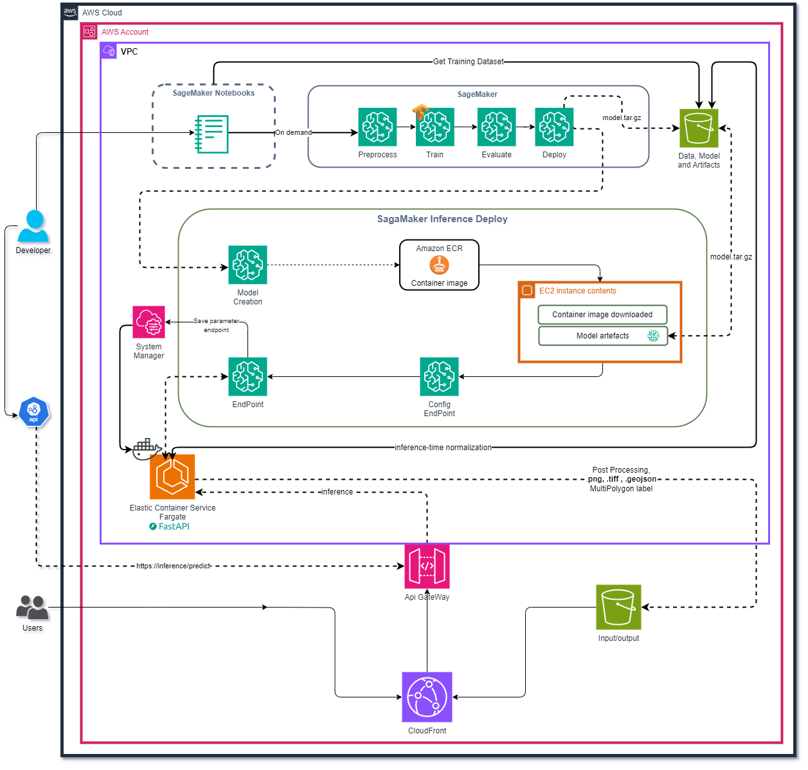
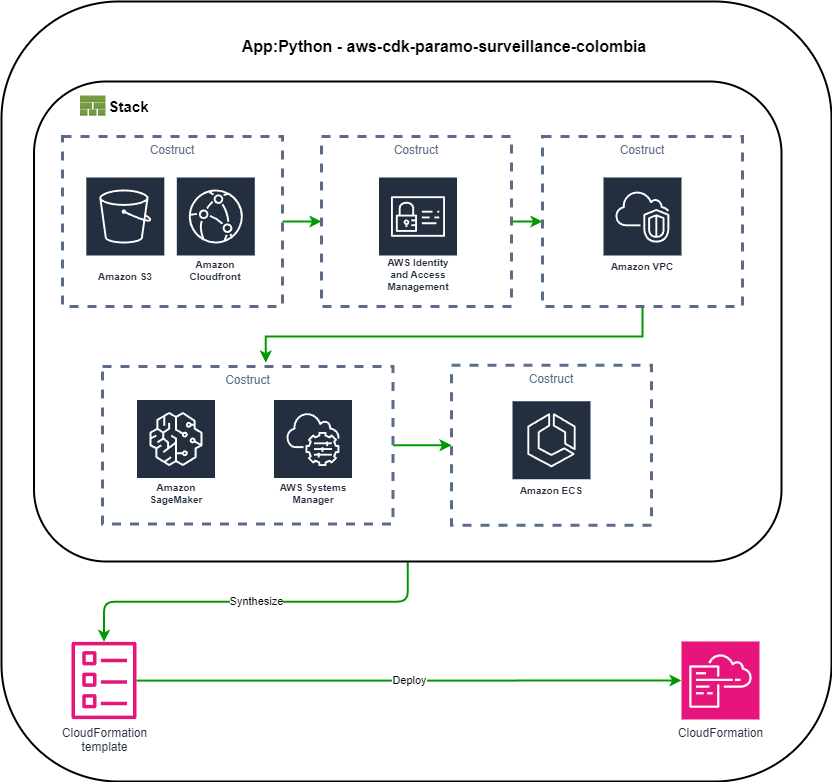

# aws-cdk-paramo 

By: Julian Alvarez Villamil.

Version: 0.1.0

AWS-CDK

[](https://sonarcloud.io/dashboard?id=julian36alvarez_aws-cdk-paramo-surveillance-colombia)


## Prerequisites

- [AWS Account](https://aws.amazon.com/)
- [Node Version Manager (NVM) >= 18.0.0 (required by AWS CDK)](https://github.com/nvm-sh/nvm)
- [Anaconda](https://www.anaconda.com/download/) >=4.x
- Optional [Mamba](https://mamba.readthedocs.io/en/latest/)
- [AWS CLI](https://docs.aws.amazon.com/cli/latest/userguide/cli-chap-install.html)

## AWS Arquitecture

The AWS architecture is described in the following diagram:



## AWS CLI

The stacks are created using the AWS CDK, the figure shows the resources created in the AWS account.




Please check your AWS CLI version:
    
```bash
aws --version
```
 ## Create AWS IAM user

1. Go to the AWS Management Console and open the IAM console at [https://console.aws.amazon.com/iam/](https://console.aws.amazon.com/iam/).

2. In the navigation pane, choose Users.

3. Choose Add user.

4. For User name, type a name for the user.

5. Choose the type of access this set of users will have. For this example, select Programmatic access.

6. Choose Next: Permissions.

7. Choose Attach existing policies directly.

8. In the search box, type AdministratorAccess.

9. Select the AdministratorAccess policy.

10. Choose Next: Tags.

11. Choose Next: Review.

12. Choose Create user.

13. To view the access key pair, choose Show. You will not have access to the secret access key again after this dialog box closes. Your secrets are stored securely and cannot be retrieved later.

14. Open your terminal and configure the AWS CLI with the access key and secret key.

    ```bash
    aws configure
    ```

15. Enter the access key and secret key, you see something like this:

    ```bash
    AWS Access Key ID [None]: <your_access_key_id>
    AWS Secret Access Key [None]: <your_secret_access_key>
    Default region name [None]: <your_region>
    Default output format [None]: json
    ```
16. Verify the configuration:

     ```bash
    aws configure list
    ```
You have created an IAM user and configured the AWS CLI.

## Create environment

remember install [conda](https://www.anaconda.com/download/) or [mamba](https://mamba.readthedocs.io/en/latest/) and create the environment:

```bash
conda env create -f environment.yml
activate aws_cdk_paramo
```

or 

```bash
mamba env create -f environment.yml
activate aws_cdk_paramo
```

## Project organization

    aws_cdk_paramo-surveillance-colombia
        ├── aws                <- AWS CDK project.
        │   ├── buckets        <- S3 bucket.
        │   └── cloudformation <- Cloudformation stack scripts to create the resources.
        │   └── ecs            <- ECS cluster.
        │   └── iam            <- IAM roles.
        │   └── sagemaker      <- SageMaker notebooks and models.
        │   └── vpc            <- VPC.
        │
        ├── unet-paramo-insight <- The source code of the application.
        │   ├── data           <- Data for the application.
        │   └── config
        |       └── constants.py <- Constants of the application.
        │   └── models         <- Models for the application.
        │   └── notebooks      <- Jupyter notebooks for the application.
        │   └── packages       <- Packages for the application.
        │   └── scripts        <- Scripts for the application.
        │   
        ├── app.py             <- The main application.
        │
        ├── cdk.json           <- The entry point for the CDK application.
        │
        ├── destroy.py         <- The script to destroy the stack.
        │
        ├── main.py            <- The script to create the stack.
        │
        ├── .gitignore         <- Files to ignore by `git`.
        │
        ├── environment.yml    <- The requirements file for reproducing the analysis environment.
        │
        └── README.md          <- The top-level README for developers using this project.

---

## User Guide

When your environment is ready, please follow the next steps:

1. Install requirements:

```bash 
pip install -r requirements.txt
```

2. Execute bootstrap command to create the stack: This command will create the stack in the AWS account that you have configured in the AWS CLI, only execute this command once.

```bash
cd aws && cdk bootstrap aws://<account_id>/<region>
```

3. Execute the deploy command to create the stack: This command will create the stack in the AWS account that you have configured in the AWS CLI, please execute this command in the root of the project.

```bash
python3 main.py
```
You should see something like this:


please confirm the changes (y/n): y

then you will see the outputs of the stack, the resources created and the data loaded in the S3 bucket.


## Data

The data used in this application is located in the `unet-paramo-insight/` folder. This data is uploaded to the S3 bucket created by the AWS CDK stack.

### Downloading the Data

Please follow these steps to download and prepare the data:

1. Download the data from the following link: [Zenodo](https://zenodo.org/record/13124217).
2. Unzip the downloaded file.
3. Copy the unzipped data and model folder to the `unet-paramo-insight/`.

### Uploading Data to S3

Once the data is in the `unet-paramo-insight/data` folder, it will be automatically uploaded to the S3 bucket when you deploy the stack using the AWS CDK.

Make sure to follow these steps to ensure the data is correctly uploaded and accessible for the application.

## Destroy the stack

Execute the destroy command to delete the stack: This command will delete the stack in the AWS account that you have configured in the AWS CLI, please execute this command in the root of the project.

```bash
python3 destroy.py
```
